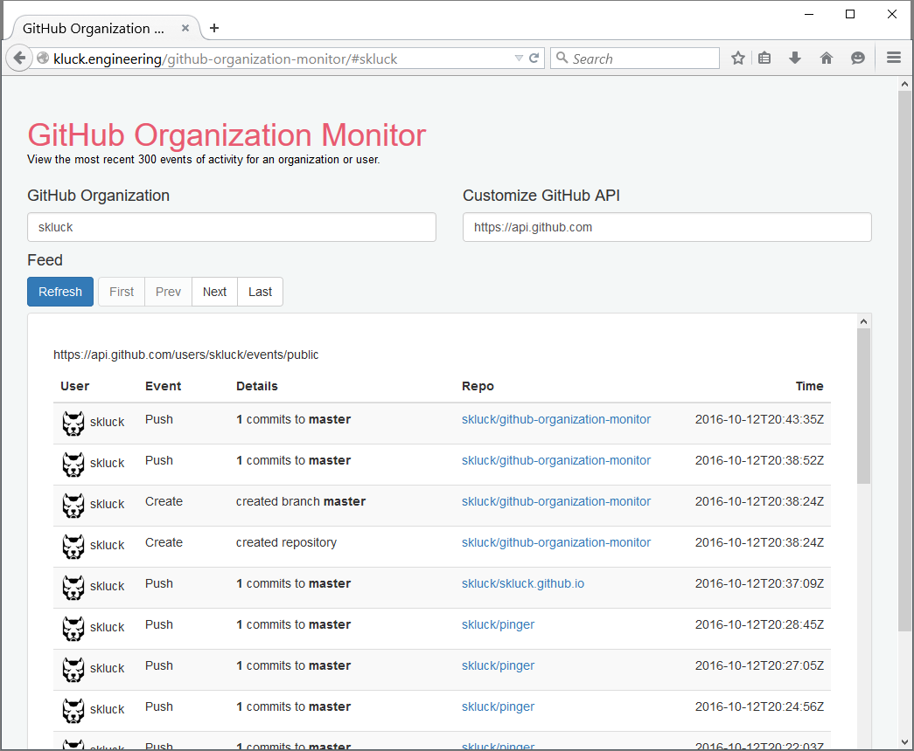

# GitHub Organization Monitor

Monitor the most recent 300 events for a GitHub organization or user.

Built using VueJS 1.x, Vue Resource, and Boostrap 3.3.

Boostrapped from Coligio demo: https://coligo.io/markdown-editor-vuejs/.

## Quick links

- [VueJS 1.0 Docs](http://v1.vuejs.org/guide/)
- [Vue Resource](https://github.com/vuejs/vue-resource)
- [Bootstrap 3.3](http://getbootstrap.com/)

### Example

